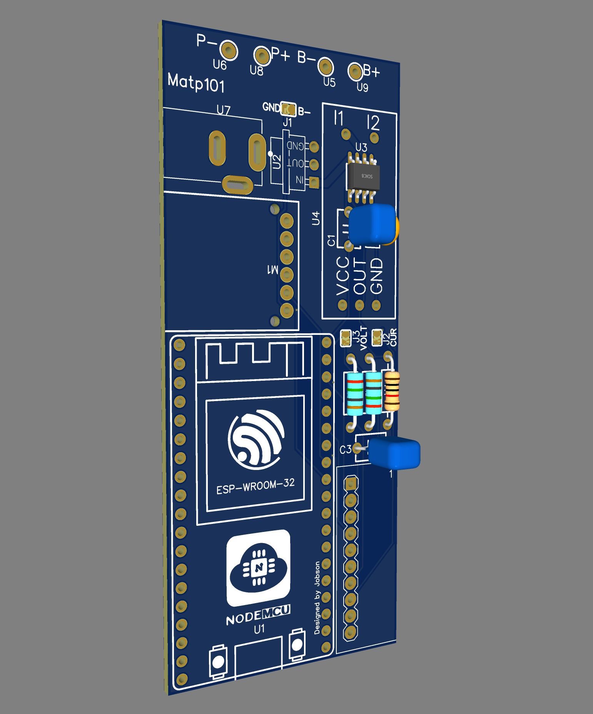
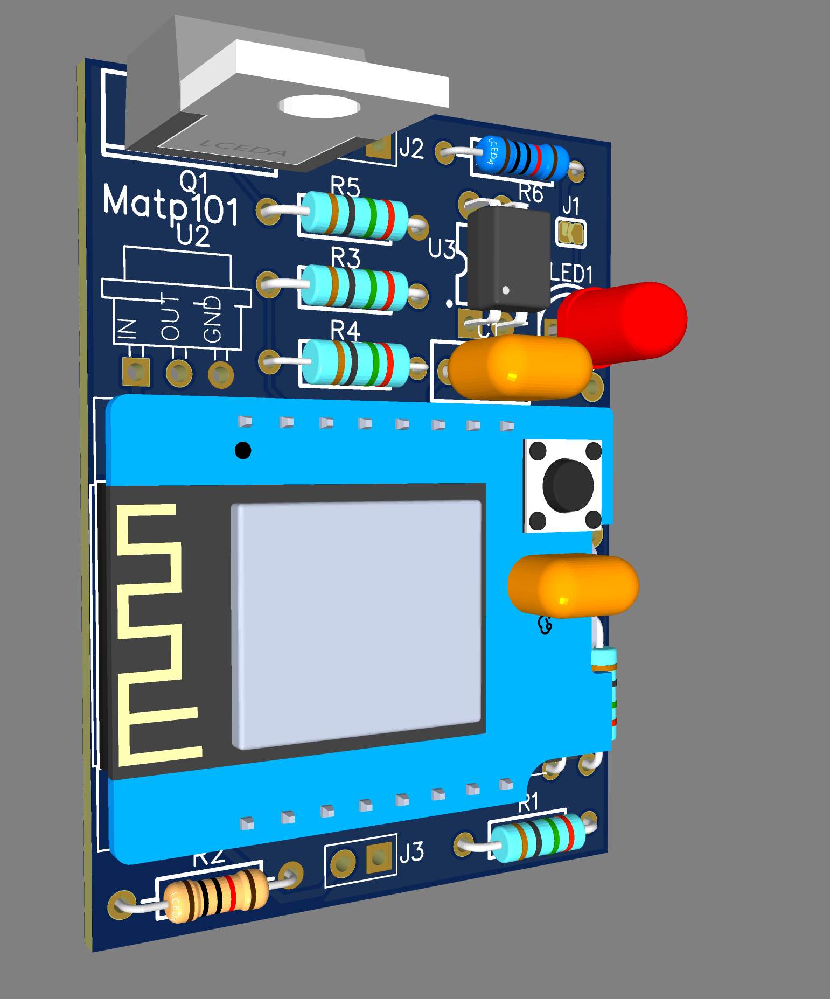

# WirelessBMS

## Project Overview

The Wireless Battery Management System (BMS) is engineered to provide comprehensive monitoring and management of battery cells for electric vehicles (EVs), energy storage systems, and other applications requiring detailed battery oversight. It boasts features such as cell voltage and temperature monitoring, advanced balancing algorithms, state of charge (SOC) estimation, and robust communication capabilities for seamless integration with broader system architectures. The system utilizes an ESP32 module for the parent unit to leverage its powerful processing capabilities and connectivity options, and ESP8266 modules for child units to efficiently handle specific tasks and communicate with the parent unit.

### Features

- **Real-Time Monitoring**: Continuous measurement of voltage and temperature parameters for each cell.
- **Data Logging**: The system records detailed logs on an SD card for analysis and record-keeping.
- **Overcharge Protection**: The circuitry is designed to prevent cells from overcharging, a critical safety feature.
- **Mesh Networking**: Parent and child units communicate over a mesh network, enhancing reliability and range.
- **User Interface**: An website that shows key information for immediate visual feedback.
- **Expandability**: This design allows for the addition of more child units to the network as needed.

### Hardware Components

- **Parent Unit**:
  - **Microcontroller**: ESP32 module for processing and network connectivity.
  - **Sensors**: Current sensor (ACS712), voltage divider components for voltage sensing.
  - **Protection**: Overcharge protection circuitry.
  - **Communication**: WiFi mesh networking.
  - **Storage**: SD card slot for data logging and retrieval.
  - **Power Supply**: Voltage regulator and battery input connectors.
  - **PCB**: Parent PCB design for mounting and connecting all components.
  
- **Child Units**:
  - **Microcontroller**: ESP8266 for individual cell monitoring tasks.
  - **Sensors**: Dedicated voltage for precise monitoring.
  - **PCB**: Child PCB design tailored to fit and function within a distributed system.

### Installation

1. **Environment Setup**: Use PlatformIO for firmware development. It provides a comprehensive ecosystem for IoT development.
2. **Board Assembly**: Refer to the Bill of Materials (BOM) and PCB design files to assemble the boards.
3. **Firmware Flashing**: Use PlatformIO to compile and upload the firmware to the ESP32 and ESP8266 modules.

### Configuration

 - **Basic Configuration**: The config.h file outlines essential settings, including communication protocols, number of cells monitored, voltage thresholds, and temperature limits.
 - **Advanced Configuration**: For further customization, adv_config.h provides options for fine-tuning balancing thresholds, SOC calculation parameters, and enhanced communication settings.
 - **Battery Configuration**: Specific battery types and their parameters, such as capacity and nominal voltage, are defined within batteries.h.
 - **Sensor Calibration**: Adjust the sensor readings according to the specific characteristics of the used components to ensure accurate measurements.

### Usage

 - **Monitoring**: Utilizes the ESP32 and ESP8266 modules to continuously monitor cell voltages and temperatures, displaying this data via a user interface or transmitting it over a network.
 - **Balancing**: Implements cell balancing through balance.hpp, applying algorithms to maintain uniform charge levels across all cells, which is crucial for maximizing battery lifespan and efficiency.
 - **SOC Estimation**: Leverages fuelgauge.hpp for accurate estimation of the battery's State of Charge, employing algorithms adapted to the battery's specific configuration for precise monitoring and management.
  
### Documentation

- **Schematics**: Detailed schematics are provided for both parent and child units to assist in understanding and modifying the circuitry.
- **PCB Designs**: PCB layout files are included for reproduction or customization of the boards.
- **BOM**: The Bill of Materials lists all components needed for assembly.

### Gallery

---
## License

This work is licensed under the Creative Commons Attribution-NonCommercial-NoDerivs 4.0 International License. To view a copy of this license, visit [http://creativecommons.org/licenses/by-nc-nd/4.0/](https://creativecommons.org/licenses/by-nc-nd/4.0/) or send a letter to Creative Commons, PO Box 1866, Mountain View, CA 94042, USA.